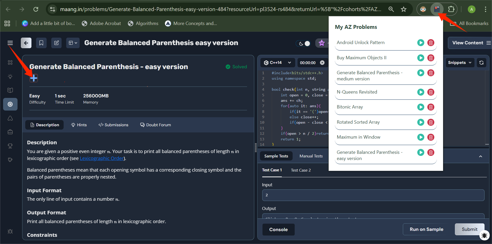

# 📑 Bookmark Chrome Extension

A lightweight **Chrome Extension** built with **HTML, CSS, and JavaScript** to manage bookmarks exclusively for [maang.in](https://maang.in/).  
This extension allows users to easily **add, delete, and directly navigate** to saved bookmarks/questions, making browsing and revision more efficient.

---

## 🚀 Features
- 📌 Add bookmarks directly while browsing [maang.in](https://maang.in/).
- 🗑️ Delete bookmarks with a single click.
- 🔗 Navigate directly to saved questions/bookmarks.
- ⚡ Simple and intuitive user interface.
- 🎯 Built lightweight for fast performance.
- 

---

## 🛠️ Tech Stack
- **Frontend:** HTML, CSS, JavaScript  
- **Tools:** Chrome Extension API, Git/GitHub  

---

